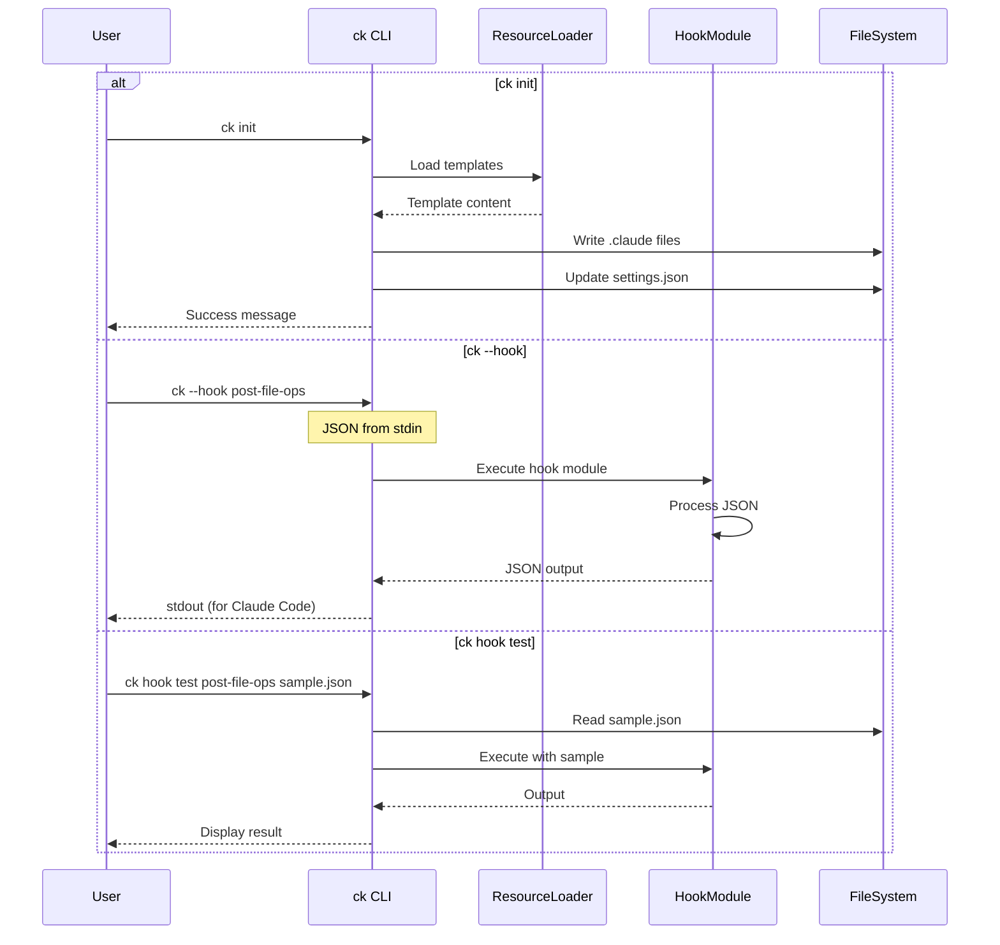

# Design: CLI with Init and Hook Management

## Architecture Overview

The CLI transforms Claude Kiro from a collection of scripts into a unified command-line tool. The architecture centers around a single `ck` command that handles both user-facing operations (init, doctor, hook management) and Claude Code operations (hook execution via `ck --hook <name>`). All resources (.md files for commands, output styles, templates) are bundled within the Python package using `importlib.resources` for offline, versioned deployment.

## Component Analysis

### Existing Components to Modify
- `pyproject.toml` - Replace `ckh-post-file-ops` entry point with `ck`, remove individual hook scripts
- `src/claude_kiro/__init__.py` - Replace placeholder with actual CLI imports
- `docs/install.sh` - Update to recommend `ck init` instead of downloading files

### New Components to Create
- `src/claude_kiro/cli.py` - Main CLI module with Click commands
- `src/claude_kiro/cli/hooks.py` - Hook subcommand group (list, test, status, config)
- `src/claude_kiro/cli/runner.py` - Hook execution runner for `ck --hook <name>`
- `src/claude_kiro/resources/__init__.py` - Resource loader module
- `src/claude_kiro/resources/templates/` - Directory for bundled .md files
- `src/claude_kiro/resources/templates/claude_md.md` - CLAUDE.md template
- `src/claude_kiro/resources/templates/output_styles/spec_driven.md` - Bundled output style
- `src/claude_kiro/resources/templates/commands/spec/create.md` - Bundled spec create command
- `src/claude_kiro/resources/templates/commands/spec/implement.md` - Bundled spec implement command
- `src/claude_kiro/resources/templates/commands/spec/review.md` - Bundled spec review command

## Data Models

### New Interfaces/Types

```python
# cli/runner.py
class HookRegistry:
    """Registry of available hooks."""
    _hooks: Dict[str, Callable] = {
        'post-file-ops': 'claude_kiro.hooks.post_file_ops_spec_context:main',
        # Future hooks added here
    }

    def get_hook(self, name: str) -> Optional[Callable]:
        """Get hook module by name."""

    def list_hooks(self) -> List[str]:
        """List all available hook names."""

# resources/__init__.py
class ResourceLoader:
    """Load bundled resources from package."""

    def get_resource(self, path: str) -> str:
        """Load resource content by path."""

    def list_resources(self) -> List[str]:
        """List all available resources."""

# cli.py
class SetupConfig:
    """Configuration for ck init."""
    force: bool = False
    project_dir: Path = Path.cwd()
    claude_dir: Path = project_dir / ".claude"
```

### Modified Interfaces
No existing interfaces need modification - hooks remain unchanged internally.

## API Endpoints (if applicable)
N/A - This is a CLI tool, not a web service.

## Data Flow



## Error Handling Strategy
- **Missing resources**: Log error, suggest reinstallation
- **File permission errors**: Catch, display friendly message with sudo suggestion if needed
- **Invalid JSON input**: Exit code 1, error to stderr for Claude Code
- **Hook not found**: Exit code 1, list available hooks
- **Corrupted settings.json**: Backup existing, create new
- **Import errors**: Suggest package reinstallation

## Testing Strategy

### Unit Tests
- Test `HookRegistry` hook discovery and loading
- Test `ResourceLoader` resource bundling and extraction
- Test CLI command parsing and argument handling
- Test settings.json merging logic
- Test error handling for each error type

### Integration Tests
- Test `ck init` creates all expected files
- Test `ck init --force` overwrites existing files
- Test `ck --hook` executes hooks correctly with JSON I/O
- Test `ck hook test` with sample data
- Test `ck doctor` detects various setup states

### Manual Testing
- Install via `uv tool install .` and verify `ck` command available
- Test hook execution from Claude Code with real settings.json
- Test init on fresh project and existing project
- Test cross-platform (Windows, Mac, Linux)

### Performance Considerations
- Expected load: `ck init` runs once per project, `ck --hook` runs on every file edit
- Optimization strategy:
  - Lazy import hooks only when needed
  - Cache resource loading in memory during execution
  - Minimal dependencies for fast startup
- Resource bundling: Use `importlib.resources` for efficient resource access

## Security Considerations
- **Input validation**: Validate all hook names against registry (no arbitrary code execution)
- **File permissions**: Respect umask, create files with appropriate permissions
- **Path traversal**: Sanitize all file paths, ensure operations stay within project
- **JSON parsing**: Use standard json module, handle malformed input gracefully
- **No eval/exec**: Never execute user-provided strings as code

## Migration Strategy
- **Phase 1**: Deploy new `ck` command
  - Both `ckh-post-file-ops` and `ck --hook post-file-ops` work
  - Documentation shows new approach
  - `ck init` configures new style

- **Phase 2**: Deprecation (next version)
  - Deprecation warning on `ckh-*` commands
  - Auto-migration tool: `ck migrate`

- **Phase 3**: Removal (future version)
  - Remove `ckh-*` entry points entirely

- **Rollback strategy**:
  - Keep `ckh-post-file-ops` entry point initially
  - Settings.json works with both command styles
  - No data format changes required

## Resource Bundling Strategy

### Package Structure
```
src/claude_kiro/
├── resources/
│   ├── __init__.py
│   └── templates/
│       ├── claude_md.md
│       ├── output_styles/
│       │   └── spec_driven.md
│       └── commands/
│           └── spec/
│               ├── create.md
│               ├── implement.md
│               └── review.md
```

### Resource Loading with importlib.resources
```python
from importlib import resources

def load_template(path: str) -> str:
    """Load template from package resources."""
    package = "claude_kiro.resources.templates"
    # Convert path like "commands/spec/create.md" to package notation
    if "/" in path:
        parts = path.split("/")
        package = f"{package}.{'.'.join(parts[:-1])}"
        filename = parts[-1]
    else:
        filename = path

    return resources.read_text(package, filename)
```

## CLI Command Structure

```bash
# Top-level with hidden hook runner
ck [OPTIONS] COMMAND [ARGS]
ck --hook <name>         # Hidden from main help, for Claude Code

# Main commands
ck init [--force]        # Initialize project
ck doctor                # Check health

# Hook subcommands
ck hook list             # List available hooks
ck hook status           # Show configured hooks
ck hook test <name>      # Test a hook
ck hook config           # Generate config snippet
```