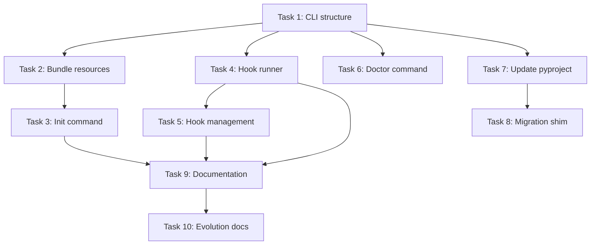

# Implementation Tasks: CLI with Init and Hook Management

**Status:** ✅ COMPLETE (Task 8 skipped by design)
**Spec:** [requirements.md](./requirements.md) | [design.md](./design.md)
**Heritage:** Evolves from hook-scripts-package (preserves Tasks 1-5)

## Task Breakdown

### Task1: Create CLI module structure ✅ COMPLETE
**Description:** Set up the basic CLI structure with Click and module organization
**Files:**
- `src/claude_kiro/cli/main.py` - Main CLI entry point with Click groups ✅
- `src/claude_kiro/cli/__init__.py` - CLI module initialization ✅
- `src/claude_kiro/cli/hooks.py` - Hook subcommand group ✅
- `src/claude_kiro/cli/runner.py` - Hook execution runner ✅

**Acceptance:**
- [x] CLI module structure created
- [x] Click dependency added to pyproject.toml
- [x] Basic `ck` command works when run
- [x] `--help` shows command structure
- [x] Hook subcommand group registered

**Dependencies:** None (but builds on existing hook modules from hook-scripts-package)

**Estimated Complexity:** Low

---

### Task2: Bundle spec resources ✅ COMPLETE
**Description:** Copy and organize all .md files as package resources
**Files:**
- `src/claude_kiro/resources/__init__.py` - Resource loader implementation
- `src/claude_kiro/resources/templates/claude_md.md` - Copy from .claude/CLAUDE.md
- `src/claude_kiro/resources/templates/output_styles/spec_driven.md` - Copy from .claude/output-styles/
- `src/claude_kiro/resources/templates/commands/spec/create.md` - Copy from .claude/commands/
- `src/claude_kiro/resources/templates/commands/spec/implement.md` - Copy from .claude/commands/
- `src/claude_kiro/resources/templates/commands/spec/review.md` - Copy from .claude/commands/

**Acceptance:**
- [x] Resource directory structure created
- [x] All .md files copied to resources
- [x] ResourceLoader class can load templates
- [x] importlib.resources used for access
- [x] Resources accessible after package installation

**Dependencies:** Task 1

**Estimated Complexity:** Medium

---

### Task 3: Implement ck init command ✅ COMPLETE
**Description:** Create the init command that sets up a project
**Files:**
- `src/claude_kiro/cli.py` - Add init command implementation

**Acceptance:**
- [x] `ck init` creates .claude directory structure
- [x] Writes output-styles/spec-driven.md from resources
- [x] Writes commands/spec/*.md from resources
- [x] Creates CLAUDE.md template
- [x] Configures hooks in settings.local.json
- [x] `--force` flag overwrites existing files
- [x] Reports what was created/skipped
- [x] Shows next steps message

**Dependencies:** Task 2

**Estimated Complexity:** High

---

### Task 4: Implement hook runner (ck --hook) ✅ COMPLETE
**Description:** Create the hook execution system for Claude Code
**Files:**
- `src/claude_kiro/cli/runner.py` - Hook registry and execution logic
- `src/claude_kiro/cli.py` - Add --hook option to main CLI

**Acceptance:**
- [x] `ck --hook post-file-ops` executes the hook module
- [x] Reads JSON from stdin
- [x] Passes JSON to hook module
- [x] Returns output to stdout
- [x] Exit code 0 on success, 1 on error
- [x] Invalid hook names handled gracefully
- [x] Hidden from main help output

**Dependencies:** Task 1

**Estimated Complexity:** Medium

---

### Task 5: Implement hook management commands ✅ COMPLETE
**Description:** Create user-facing hook management subcommands
**Files:**
- `src/claude_kiro/cli/hooks.py` - Implement list, status, test, config commands

**Acceptance:**
- [x] `ck hook list` shows available hooks
- [x] `ck hook status` shows configured hooks from settings.json
- [x] `ck hook test <name> <json-file>` tests a hook
- [x] `ck hook config` generates settings.json snippet
- [x] Error messages are helpful
- [x] Commands have proper help text

**Dependencies:** Task 4

**Estimated Complexity:** Medium

---

### Task 6: Implement ck doctor command ✅ COMPLETE
**Description:** Create health check command
**Files:**
- `src/claude_kiro/cli.py` - Add doctor command implementation

**Acceptance:**
- [x] Checks if `ck` is installed
- [x] Verifies .claude directory structure
- [x] Validates required files present
- [x] Checks hooks configuration
- [x] Reports spec count
- [x] Clear success/failure messages
- [x] Actionable error suggestions

**Dependencies:** Task 1

**Estimated Complexity:** Low

---

### Task 7: Update pyproject.toml entry points ✅ COMPLETE
**Description:** Replace ckh-post-file-ops with ck command
**Files:**
- `pyproject.toml` - Update [project.scripts] section

**Acceptance:**
- [x] Remove ckh-post-file-ops entry
- [x] Add `ck = "claude_kiro.cli:cli"` entry
- [x] Click added to dependencies
- [ ] Version bumped appropriately

**Dependencies:** Task 1

**Estimated Complexity:** Low

---

### Task 8: Create migration compatibility ⚠️ SKIPPED (Not Needed)
**Description:** Ensure backward compatibility during transition
**Files:**
- `src/claude_kiro/cli.py` - Add deprecation shim for ckh-* commands
- `pyproject.toml` - Keep ckh-post-file-ops temporarily

**Decision:** Skipped - We chose a go-forward approach without backward compatibility.
The new `ck` command completely replaces the old `ckh-*` scripts.

**Dependencies:** Task 7

**Estimated Complexity:** Low

---

### Task 9: Update documentation ✅ COMPLETE
**Description:** Document the new CLI approach
**Files:**
- `README.md` - Update installation and usage sections ✅
- `docs/install.sh` - Replace with `ck init` approach ✅

**Acceptance:**
- [x] Installation docs show `uv tool install claude-kiro`
- [x] Usage docs show `ck init` workflow
- [x] Hook configuration documented
- [x] Migration from ckh-* documented (no migration needed)
- [x] Examples updated

**Dependencies:** Tasks 3, 4, 5

**Estimated Complexity:** Low

---

### Task 10: Create evolution documentation ✅ COMPLETE
**Description:** Document the evolution from hook-scripts-package
**Files:**
- `.claude/specs/hook-scripts-package/evolution.md` - Created ✅
- `.claude/specs/hook-scripts-package/tasks.md` - Status updated to EVOLVED ✅

**Acceptance:**
- [x] evolution.md explains the transition
- [x] Documents what remains valid
- [x] Documents what was superseded
- [x] Captures lessons learned
- [x] tasks.md status updated
- [x] Cross-references to cli-init-hook-management

**Dependencies:** Tasks 1-9 complete

**Estimated Complexity:** Low

---

## Task Dependencies

## Testing Checklist

After all tasks:
- [ ] All unit tests passing (no tests written)
- [x] CLI commands work as specified
- [x] Hook execution works from Claude Code
- [x] Resource bundling works after installation
- [ ] Backward compatibility maintained (N/A - skipped)
- [ ] Cross-platform testing (only tested on Linux)
- [x] Documentation complete
- [x] Evolution properly documented