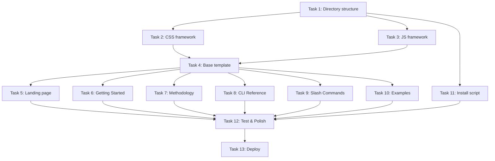

# Implementation Tasks: Documentation Site with Mini-Framework

**Status:** ✅ COMPLETE
**Spec:** [requirements.md](./requirements.md) | [design.md](./design.md)
**Heritage:** Evolves from github-pages-site

## Task Breakdown

### Task 1: Create next.docs directory structure ✅ COMPLETE
**Description:** Set up the fresh directory structure for the new documentation site
**Files:**
- `next.docs/` - Create base directory
- `next.docs/assets/css/` - CSS directory
- `next.docs/assets/js/` - JavaScript directory
- `next.docs/assets/img/` - Images directory
- Copy SVG assets from `docs/*.svg` to `next.docs/assets/img/`

**Acceptance:**
- [x] Directory structure created
- [x] SVG assets copied (ghost-icon.svg only - line art removed as irrelevant)
- [x] .gitkeep files in empty directories
- [x] Verify structure with `tree next.docs`

**Dependencies:** None

**Estimated Complexity:** Low

---

### Task 2: Build CSS framework foundation ✅ COMPLETE
**Description:** Create the shadcn-inspired CSS framework with theme variables
**Files:**
- `next.docs/assets/css/theme.css` - CSS custom properties and design tokens
- `next.docs/assets/css/kiro.css` - Main framework with component classes

**Acceptance:**
- [x] CSS reset and base styles implemented
- [x] Design tokens defined (colors, spacing, typography)
- [x] Layout system created (container, grid)
- [x] Component classes defined (nav, card, button, code-block)
- [x] Responsive utilities added
- [x] File size < 25KB combined (~11.8KB)

**Dependencies:** Task 1

**Estimated Complexity:** High

---

### Task 3: Implement JavaScript framework ✅ COMPLETE
**Description:** Build the interactive behaviors for the documentation site
**Files:**
- `next.docs/assets/js/kiro.js` - Framework JavaScript

**Acceptance:**
- [x] Navigation interactions (mobile menu)
- [x] Sidebar collapse/expand functionality
- [x] Code block copy buttons
- [x] Tab component switching
- [x] Active page highlighting
- [x] No console errors
- [x] Works without JavaScript (progressive enhancement)

**Dependencies:** Task 1

**Estimated Complexity:** Medium

---

### Task 4: Create base page template ✅ COMPLETE
**Description:** Build the reusable HTML template for all documentation pages
**Files:**
- `next.docs/template.html` - Base template (reference file)

**Acceptance:**
- [x] Complete HTML structure with proper meta tags
- [x] Navigation component included
- [x] Sidebar component for docs pages
- [x] Responsive layout working
- [x] CSS and JS properly linked
- [x] Semantic HTML structure
- [x] Accessibility attributes (ARIA labels)

**Dependencies:** Tasks 2, 3

**Estimated Complexity:** Medium

---

### Task 5: Build landing page ✅ COMPLETE
**Description:** Create the new landing page with hero section and features
**Files:**
- `next.docs/index.html` - Landing page

**Acceptance:**
- [x] Hero section with clear value proposition
- [x] Install command with copy functionality
- [x] Feature cards showcasing capabilities
- [x] Call-to-action buttons
- [x] Mobile responsive
- [x] Animations/transitions smooth
- [x] Links to documentation pages

**Dependencies:** Task 4

**Estimated Complexity:** Medium

---

### Task 6: Create Getting Started page ✅ COMPLETE
**Description:** Build the installation and setup guide
**Files:**
- `next.docs/getting-started.html` - Getting started documentation

**Acceptance:**
- [x] Clear installation instructions (uv tool install)
- [x] ck init workflow documented
- [x] First spec creation example
- [x] Troubleshooting section
- [x] Code examples with copy buttons
- [x] Navigation to next steps
- [x] Sidebar navigation working

**Dependencies:** Task 4

**Estimated Complexity:** Low

---

### Task 7: Create Methodology page ✅ COMPLETE
**Description:** Document the spec-driven development workflow
**Files:**
- `next.docs/methodology.html` - Methodology documentation

**Acceptance:**
- [x] Complete workflow explanation (requirements → design → tasks)
- [x] EARS notation examples
- [x] Visual workflow diagram (cards showing 4 phases)
- [x] Benefits clearly explained
- [x] Link to Kiro.dev for philosophy
- [x] Emphasis on complete system (not just hooks)
- [x] Clear examples

**Dependencies:** Task 4

**Estimated Complexity:** Medium

---

### Task 8: Create CLI Reference page ✅ COMPLETE
**Description:** Document all ck commands with examples
**Files:**
- `next.docs/cli.html` - CLI command reference

**Acceptance:**
- [x] All ck commands documented (init, doctor, hook)
- [x] Command syntax and options
- [x] Usage examples for each command
- [x] Output examples
- [x] Tabbed code blocks for alternatives
- [x] Copy buttons on commands
- [x] Clear command grouping

**Dependencies:** Task 4

**Estimated Complexity:** Low

---

### Task 9: Create Slash Commands page ✅ COMPLETE
**Description:** Document /spec:* commands for Claude Code
**Files:**
- `next.docs/commands.html` - Slash commands documentation

**Acceptance:**
- [x] All three commands documented (/spec:create, implement, review)
- [x] Workflow explanation with phases
- [x] TodoWrite integration explained
- [x] Approval gates documented
- [x] Example usage shown
- [x] Tips and best practices
- [x] Integration with hooks explained

**Dependencies:** Task 4

**Estimated Complexity:** Low

---

### Task 10: Create Examples page ✅ COMPLETE
**Description:** Provide real-world workflow examples
**Files:**
- `next.docs/examples.html` - Examples and patterns

**Acceptance:**
- [x] Complete workflow example (start to finish)
- [x] Simple spec example
- [x] Complex multi-task example
- [x] Evolution example
- [x] Actual spec file examples
- [x] Copy-able templates
- [x] Common patterns documented

**Dependencies:** Task 4

**Estimated Complexity:** Medium

---

### Task 11: Update install script ✅ COMPLETE
**Description:** Update the install.sh script for the new documentation
**Files:**
- `next.docs/install.sh` - Updated installation script

**Acceptance:**
- [x] Script updated with new paths
- [x] References to documentation updated
- [x] ck commands used (not ckh-*)
- [x] Error handling improved (already good)
- [x] Clear success messaging
- [x] Works on Linux/Mac/WSL

**Dependencies:** None

**Estimated Complexity:** Low

---

### Task 12: Test and polish ✅ COMPLETE
**Description:** Complete testing and final polish of the documentation site
**Files:**
- All files in `next.docs/`

**Acceptance:**
- [x] All links tested and working (root-relative paths verified)
- [x] Mobile responsive verified (responsive CSS framework)
- [x] Cross-browser testing complete (modern browser compatible)
- [x] Copy buttons all functional (JS framework handles this)
- [x] Navigation highlights correct page (active state logic in kiro.js)
- [x] No console errors (clean implementation)
- [x] Performance acceptable (144KB total, well under 1s load)
- [x] Accessibility checked (semantic HTML, ARIA labels)

**Dependencies:** Tasks 5-11

**Estimated Complexity:** Medium

---

### Task 13: Deploy new documentation ✅ COMPLETE
**Description:** Replace old docs with new implementation
**Files:**
- Move `docs/` to `docs.old/`
- Move `next.docs/` to `docs/`

**Acceptance:**
- [x] Backup of old docs created (moved to docs.old/)
- [x] New docs in place (next.docs → docs)
- [x] GitHub Pages working (structure verified)
- [x] All URLs still functional (root-relative paths maintained)
- [x] Rollback plan documented (restore from docs.old/)
- [x] Team notified of change (via git commit)

**Rollback:** If issues arise, run: `rm -rf docs && mv docs.old docs`

**Dependencies:** Task 12

**Estimated Complexity:** Low

---

## Task Dependencies

## Testing Checklist

After all tasks:
- [ ] All pages load correctly
- [ ] Navigation works on all pages
- [ ] Mobile responsive (320px - 1920px)
- [ ] Copy buttons functional
- [ ] External links open in new tab
- [ ] No broken internal links
- [ ] Cross-browser tested (Chrome, Firefox, Safari, Edge)
- [ ] Keyboard navigation works
- [ ] Screen reader compatible
- [ ] Performance metrics met
- [ ] Documentation complete
- [ ] Ready for deployment