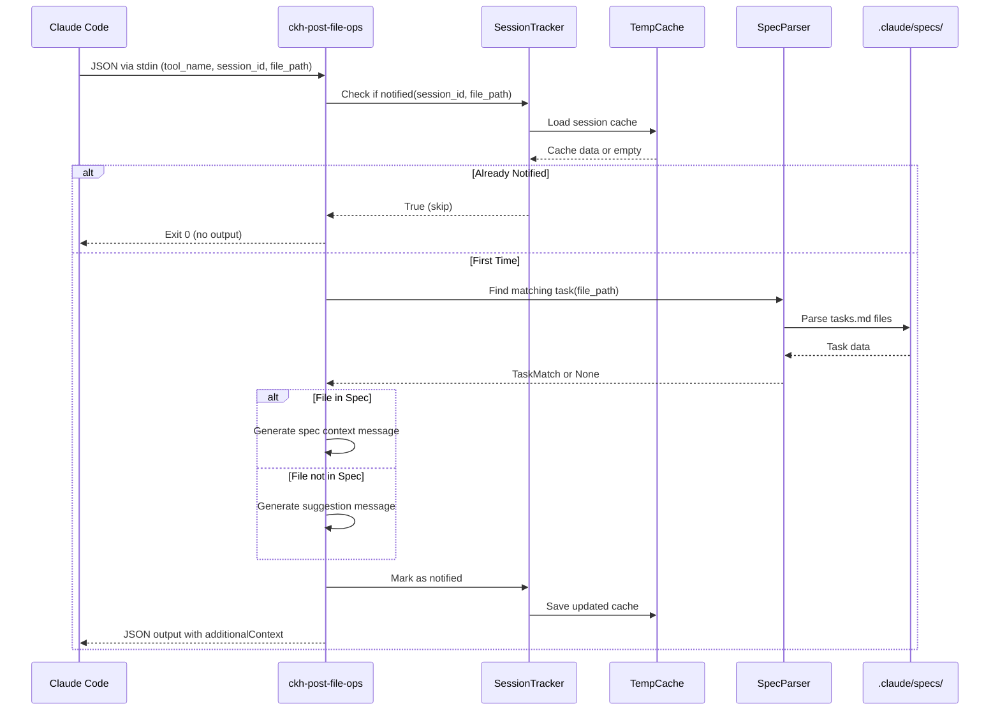

# Design: Hook Scripts as Installable Python Package

## Architecture Overview
Transform the existing file-based hook (`spec-file-matcher.py`) into a structured Python package with installable command-line entry points. The package will be distributed via PyPI/uv and installed globally using `uv tool install claude-kiro`. Hooks will be organized as Python modules with shared utilities for common functionality like session tracking and spec parsing.

## Component Analysis

### Existing Components to Modify
- `pyproject.toml` - Add script entry points for each hook command
- `.claude/hooks/spec-file-matcher.py` - Will be migrated to package structure (can be deleted after migration)
- `docs/install.sh` - Update to mention hook installation via uv tool

### New Components to Create
- `src/claude_kiro/hooks/__init__.py` - Hook module initialization
- `src/claude_kiro/hooks/post_file_ops_spec_context.py` - Main hook implementation
- `src/claude_kiro/hooks/_shared/__init__.py` - Shared utilities initialization
- `src/claude_kiro/hooks/_shared/session_tracker.py` - Session-based notification tracking
- `src/claude_kiro/hooks/_shared/spec_parser.py` - Spec file parsing and task matching
- `src/claude_kiro/hooks/_shared/cache_manager.py` - Temp file management and cleanup

## Data Models

### New Interfaces/Types

```python
# session_tracker.py
class SessionCache:
    session_id: str
    session_start: float  # Unix timestamp
    files_notified: Dict[str, FileNotificationRecord]

class FileNotificationRecord:
    timestamp: float  # Unix timestamp
    in_spec: bool
    spec_name: Optional[str]
    task_num: Optional[str]
    context: Optional[str]  # For future: "formatter", "linter", etc.

# spec_parser.py
class TaskMatch:
    spec_name: str
    task_num: str
    task_title: str
    files: List[str]

# cache_manager.py
class CacheConfig:
    cache_dir: Path
    ttl_seconds: int = 86400  # 24 hours
    max_size_mb: float = 1.0
```

### Modified Interfaces
No existing interfaces need modification as this is a new package structure.

## API Endpoints (if applicable)
N/A - This is a command-line tool package, not a web service.

## Data Flow



## Error Handling Strategy
- **Invalid JSON input**: Log to stderr, exit with code 1
- **Missing session_id**: Use "unknown" as fallback, continue operation
- **Cache file corruption**: Delete corrupted cache, start fresh
- **Spec file not found**: Gracefully handle as "no specs" scenario
- **Permission errors on temp files**: Fall back to no caching (show message every time)
- **Regex parsing failures**: Log warning, treat as no match

## Testing Strategy

### Unit Tests
- Test `SessionTracker` cache operations (load, save, cleanup)
- Test `SpecParser` regex patterns with various task.md formats
- Test `CacheManager` TTL enforcement and size limits
- Test error handling for corrupted cache files
- Test session isolation (different sessions don't interfere)

### Integration Tests
- Test full hook flow with mock Claude Code input
- Test session tracking across multiple file edits
- Test spec detection with real spec file structures
- Test cleanup of old sessions

### Performance Considerations
- Expected load: Hook called on every file edit (potentially 100+ times per session)
- Optimization strategy:
  - Cache spec parsing results in memory during execution
  - Use efficient JSON operations
  - Minimize file I/O operations
- Caching strategy:
  - Session cache in system temp directory
  - Auto-cleanup after 24 hours
  - Max 1MB per session file

## Security Considerations
- **Input validation**: Validate all JSON input fields
- **Path traversal prevention**: Sanitize file paths, prevent access outside project
- **Temp file permissions**: Use 0600 (user read/write only) for cache files
- **No code execution**: Never eval() or exec() user input
- **Session isolation**: Each session has separate cache file

## Migration Strategy
- **Phase 1**: Package creation (this implementation)
  - Create package structure
  - Users install via `uv tool install claude-kiro`
  - Update settings.json to use command names
- **Phase 2**: Transition period
  - Both file-based and package hooks work
  - Documentation shows both methods
  - Deprecation notice for file-based approach
- **Phase 3**: File-based removal (future release)
  - Remove file-based hook support
  - Clean migration guide provided
- **Rollback strategy**:
  - Keep original spec-file-matcher.py as backup
  - Settings.json can point back to file path if needed
  - No data migration required (stateless except temp cache)