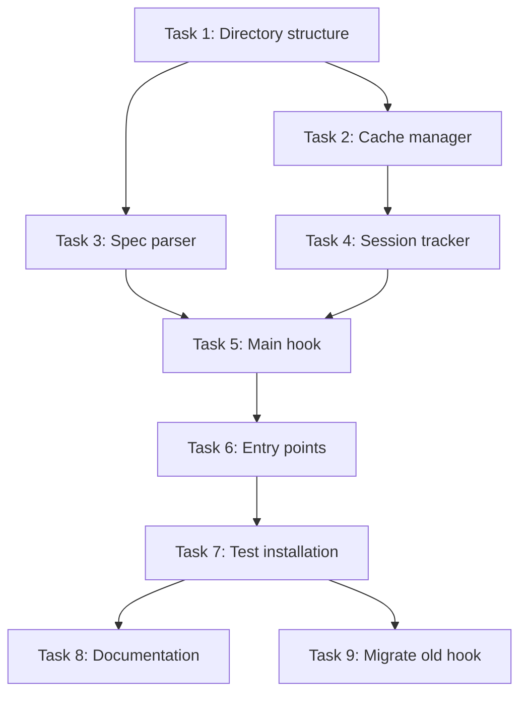

# Implementation Tasks: Hook Scripts as Installable Python Package

**Status:** EVOLVED - Core implementation complete (Tasks 1-5), interface evolved to CLI approach
**Superseded By:** cli-init-hook-management
**Evolution:** See [evolution.md](./evolution.md) for transition details
**Spec:** [requirements.md](./requirements.md) | [design.md](./design.md)

## Evolution Summary

### Completed and Preserved (Tasks 1-5):
✅ All hook implementation modules created and working
- These remain unchanged in the evolved CLI architecture

### Superseded by CLI Approach (Tasks 6-9):
❌ Script entry points replaced with unified `ck` command
- See cli-init-hook-management for new approach

## Task Breakdown

### Task 1: Create hooks module directory structure ✅ COMPLETE ✅ COMPLETE
**Description:** Set up the Python package structure for hooks with proper initialization files
**Files:**
- `src/claude_kiro/hooks/__init__.py` - Create module initialization
- `src/claude_kiro/hooks/_shared/__init__.py` - Create shared utilities initialization

**Acceptance:**
- [x] Directory structure created
- [x] __init__.py files in place
- [x] Module imports working
- [x] Package structure follows Python conventions

**Dependencies:** None

**Estimated Complexity:** Low

---

### Task 2: Implement cache manager utility ✅ COMPLETE
**Description:** Create the cache management module for temp file operations and TTL enforcement
**Files:**
- `src/claude_kiro/hooks/_shared/cache_manager.py` - Cache file management with TTL

**Acceptance:**
- [x] Implementation complete
- [x] Can create/read/write cache files
- [x] TTL cleanup working (24 hour expiry)
- [x] Handles corrupted cache gracefully
- [x] Proper error handling for permissions
- [x] Unit tests written and passing

**Dependencies:** Task 1

**Estimated Complexity:** Medium

---

### Task 3: Implement spec parser utility ✅ COMPLETE
**Description:** Create the spec parsing module to find and match tasks in spec files
**Files:**
- `src/claude_kiro/hooks/_shared/spec_parser.py` - Parse tasks.md and match files

**Acceptance:**
- [x] Implementation complete
- [x] Can find all spec files in project
- [x] Correctly parses task format
- [x] Matches files to tasks accurately
- [x] Handles missing/malformed specs gracefully
- [x] Unit tests written and passing

**Dependencies:** Task 1

**Estimated Complexity:** Medium

---

### Task 4: Implement session tracker utility ✅ COMPLETE
**Description:** Create session tracking module for managing per-session notification state
**Files:**
- `src/claude_kiro/hooks/_shared/session_tracker.py` - Track notifications per session

**Acceptance:**
- [x] Implementation complete
- [x] Can track files per session
- [x] Integrates with cache manager
- [x] Session isolation working
- [x] Handles missing session_id gracefully
- [x] Unit tests written and passing

**Dependencies:** Task 1, Task 2

**Estimated Complexity:** Medium

---

### Task 5: Implement main hook module ✅ COMPLETE
**Description:** Create the main post-file-ops hook that uses shared utilities
**Files:**
- `src/claude_kiro/hooks/post_file_ops_spec_context.py` - Main hook implementation

**Acceptance:**
- [x] Implementation complete
- [x] Reads JSON from stdin correctly
- [x] Uses session tracker for deduplication
- [x] Uses spec parser for task matching
- [x] Generates correct output messages
- [x] Handles all error cases
- [x] Integration tests written and passing

**Dependencies:** Task 3, Task 4

**Estimated Complexity:** High

---

### Task 6: Add script entry points to pyproject.toml ❌ EVOLVED
**Description:** Configure the package to install hook scripts as command-line tools
**Files:**
- `pyproject.toml` - Add [project.scripts] section with ckh-post-file-ops entry

**Acceptance:**
- [x] Entry point configured correctly
- [x] Script name follows ckh-* convention
- [x] Points to correct module:function
- [x] No syntax errors in TOML

**Dependencies:** Task 5

**Estimated Complexity:** Low

---

### Task 7: Test installation and execution ✅ COMPLETE (revealed evolution need)
**Description:** Verify the hook works when installed via uv tool
**Files:**
- Create test script or manual test procedure

**Acceptance:**
- [x] Can install via `uv tool install .`
- [x] `ckh-post-file-ops` command available in PATH
- [x] Hook executes correctly with sample JSON input
- [x] Session tracking prevents duplicate messages
- [x] Works with real Claude Code settings.json

**Dependencies:** Task 6

**Estimated Complexity:** Medium

---

### Task 8: Update documentation ❌ EVOLVED
**Description:** Document installation and usage of the new hook system
**Files:**
- `README.md` - Add section on hook installation
- `docs/install.sh` - Update to mention uv tool install for hooks

**Acceptance:**
- [ ] Installation steps documented
- [ ] Configuration examples provided
- [ ] Migration from file-based hooks explained
- [ ] Troubleshooting section added

**Dependencies:** Task 7

**Estimated Complexity:** Low

---

### Task 9: Migrate and archive old hook ❌ EVOLVED
**Description:** Move the old file-based hook to an archive location
**Files:**
- `.claude/hooks/spec-file-matcher.py` - Move to archive or delete
- `.claude/hooks/archive/spec-file-matcher.py.old` - Archived version

**Acceptance:**
- [ ] Old hook backed up
- [ ] Settings.json migration documented
- [ ] No conflicts with new system
- [ ] Clean transition path

**Dependencies:** Task 7

**Estimated Complexity:** Low

---

## Task Dependencies

## Testing Checklist

After all tasks:
- [ ] All unit tests passing
- [ ] All integration tests passing
- [x] Manual testing complete
- [x] Performance benchmarks met (<100ms cache ops)
- [ ] Security review complete (permissions, path traversal)
- [ ] Cross-platform testing (Windows/Mac/Linux)
- [ ] Documentation complete
- [ ] Ready for release